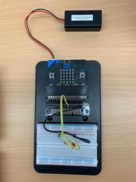

# Inventor Kit Experiments

*Markdown reference: https://guides.github.com/features/mastering-markdown/*

## Instructions ##

*For a selection of 5 inventor kit experiments that you choose, fill out the following sections.

### Experiment Name ###

Say “Hello” to the BBC micro: bit!

#### Photo of completed project ####
*In the code below, replace `missingimage.png` with the name of the image, which should be in the `kitexperiments` folder.*

This is an image of the completed experiment.

#### Reflection ####

This was the first experiment that was conducted. This was the first experiment in the inventor’s kit booklet. This experiment is extremely straight forward and mainly focuses on allowing the user to gain an understanding as to how the micro: bit works. The goal of this experiment was to get the micro: bit to create a smiley face when button A is pressed, and then for the words “Hello World!” to appear once button 2 was pressed. This experiment took around 10 minutes to complete as there were no issues that were faced during the building process. This experiment could be used in the basis of a real-world application such as the traffic signs that display words to instruct traffic of upcoming roadworks etc. 

### Experiment name ###

Using a Light Sensor & Analog Inputs 

#### Photo of completed project ####
In the code below, replace imagemissing.jpg with the name of the image, which should be in the kitexperiments folder.

This is an image of the completed experiment.

#### Reflection ####

Unlike the first experiment, I found that this experiment was more difficult. The code itself was extremely straightforward and easy to create to then download. The main issue that I faced was that the phototransistor was not working originally. This was extremely frustrating as the micro: bit would not chance from the sun symbol even when the phototransistor was covered in darkness. Through closer examination, I was able to notice that I had misplaced the legs of the phototransistor on the breadboard. It took me a while to discover what the issue was that I was facing as this was only the second experiment that I had attempted, so I was still extremely confused as to how the micro: bit works. However, once I fixed this issue, the experiment was working. The sun symbol would appear when the photo transistor was in a light environment, and then when I would place my fingers over the photo transistor, the moon symbol would appear. In the end, the experiment was a success. Something new that I learned in this experiment was how the phototransistor works. This experiment could be used in the basis of a real-world application such as the roadworks signs once again, but the text displayed could change when the time of day changes to keep people updated on what is happening during that time of the day. 

### Experiment name ###

Using the Accelerometer to Control Motor Speed

#### Photo of completed project ####
In the code below, replace imagemissing.jpg with the name of the image, which should be in the kitexperiments folder.

This is an image of the completed experiment.

#### Reflection ####

This experiment was extremely difficult in comparison to the previous experiments. I haven’t been having any issues with the coding itself on make code as it is relatively straight forward. The main uses I kept having was the placement of the different parts on the breadboard. When I put together the part on the breadboard, the experiment was not working. Through close examination, I noticed that I has misplaced some parts on the board were once again misplaced. This was an experiment that took quite a long time to fix up, however, once I moved the parts to the correct sections. The fan did turn on. This experiment could be used in the basis of a real-world application such as a remote that changes the speed of a fan.

### Experiment name ###

Using the Accelerometer to Control Motor Speed (part 2)

#### Photo of completed project ####
In the code below, replace imagemissing.jpg with the name of the image, which should be in the kitexperiments folder.

This is an image of the completed experiment.

#### Reflection ####

This experiment was quite easy as it had an identical set up to the previous experiment. However, this time, the way in which the micro: bit was angled determined the speed of the fan. The code was the main focus of this experiment. This was a really beneficial experiment for me to focus on as it allowed for me to really gain an understanding regarding the coding of the micro: bit. As the power board parts had already been built, I was able to focus mainly on the coding. This allowed for me to go through an examine each individual part of the code. Once the code was complete and downloaded onto the micro: bit, the experiment was tested and proved to be successful as the fan would increase in speed when the micro: bit was angled. This experiment could be used in the basis of a real-world application such as a remote that changes the speed of a fan depending on the way that it is angled.

### Experiment name ###

 Making the Light Flash Every 2 seconds

#### Photo of completed project ####
In the code below, replace imagemissing.jpg with the name of the image, which should be in the kitexperiments folder.

This is an image of the completed experiment. 

#### Reflection ####
Unlike all of the previous experiments, this one was completed during one of our studio sessions. The goal of this experiment was to have the light turn on for approximately 3 seconds, and then proceed to flash for one second every two seconds. For this experiment to be successful, I had to follow a previous example of how to set up a power board with a light. I then had to go onto make code and create a code that would successful create the output that I was attempting to achieve. Originally, I was struggling to wrap my head around how I was supposed to create the correct code, but with assistance, I was able to create the correct code. This then resulted in the experiment being a success. This experiment could be used in the basis of a real-world application such as a traffic light that allows pedestrians to cross the street. After a certain amount of time, the light can flash from red to green, indicating that they can go. 

