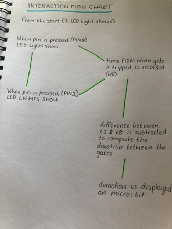
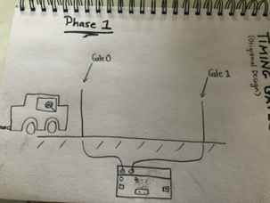
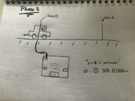
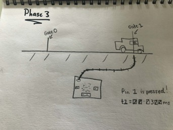
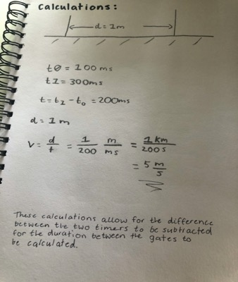
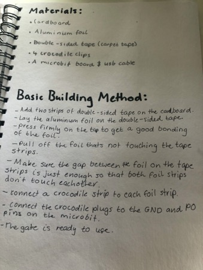
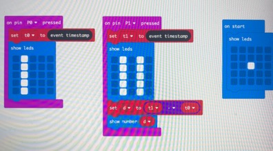
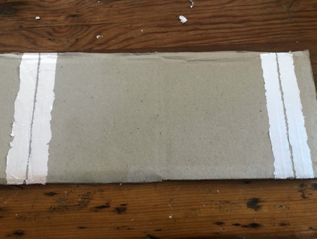
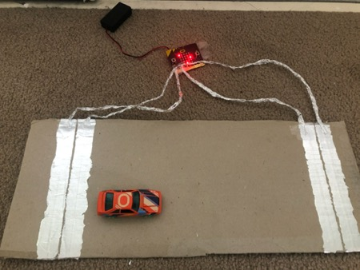
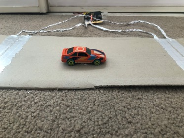

# Assessment 1: Replication project

*Fill out the following workbook with information relevant to your project.*

*Markdown reference:* [https://guides.github.com/features/mastering-markdown/](http://guides.github.com/features/mastering-markdown/)

## Replication project choice ##
Timing Gates

## Related projects ##

### Related project 1 ###
Timing Gate Measuring

https://www.youtube.com/watch?v=piyym_ux1EM

This project is similar to the project that I am creating because it is also a timing gate. This project creates the same result however, this project uses crocodile clips to the micro: bit. My project however, does not use crocodile clips and instead uses aluminium foil to make the connection between the micro: bit and the project that has been built. The project uses the same code as well as the same layout on the breadboard to create these results. 

### Related project 2 ###
Timing Gate Micro: bit

https://www.youtube.com/watch?v=GL4hSNFFMV4

This project is similar to mine as it is also another timing gate. This is another example created by two school girls. This project is very similar to the project above, however, these individuals choose to simply hold the wires down on the pin when they want to activate the device. The same results are achieved otherwise. 

### Related project 3 ###
Infrared Timing Gate

https://bigl.es/micro-bit-infrared-timing-gate/

This project is another replica of the timing gates. This project is substantially more advanced and has used a bigger object to utilise as their project. As you can see in the image, the chair is being used as the two ends. This is where the two pieces of paper are being used as the sections where the timing will be activated. This is simply a more developed version of the project that I am creating. 

### Related project 4 ###
Timing Gate Sensor

https://www.youtube.com/watch?v=M3DIUvDPlIA

This project is another example exactly alike project 1 & 2. As you can see, once again, the crocodile clips have been used for this project, whereas my project will not contain any crocodile clips. However, both this project and my project will achieve the same result. 

### Related project 5 ###
Speed and the BBC Micro: bit

http://downloads.bbc.co.uk/learning/livelessons/speedworksheet.pdf

As you can see in the image, this project Is quite different to the project that I am creating. Rather than being a timing gate, this project however calculates the speed of the cars from a certain distance. The similarity that this project has to the project that I am creating is that they both are calculating a result from one point to another. 

### Related project 6 ###
Toy Car Timing Gate

https://www.thingiverse.com/thing:3614266

This project is another example of a timing gate created by Astrotutor. In this project, the torch shines a light onto the sensitive LED of the Micro: bit and sends a radio message to a third micro: bit that then calculates the overall time and speed. This is a different method that is used in comparison to the other projects, however, it produces the same overall result.   

## Reading reflections ##

### Reading: Don Norman, The Design of Everyday Things, Chapter 1 (The Psychopathology of Everyday Things) ###

*What I thought before: Describe something that you thought or believed before you read the source that was challenged by the reading.*

Before I read the source, I was unaware that there were perceived affordances. I believed that everything that was placed was there to provide a specific purpose rather than to mislead certain individuals. I was also did not think that there was specific terminology for each of these factors and that they all play an important role in everyday objects and how we as humans perceive them. 

*What I learned: Describe what you now know or believe as a result of the reading. Don't just describe the reading: write about what changed in YOUR knowledge.*

From reading this article, I learned that there are many fundamental principles of interaction in regard to the everyday objects in our lives that we are not aware of. Something that may seem so basic to us, such as a chair or table actually contains different factors that affect the usage etc. there are several factors such as affordances, signifiers, mapping etc. that all contribute to the usage of an object. The affordances, such as the weight, size etc. all contribute to who can use the item. The signifiers assist in helping people understand how to use the item and mapping assist people in understanding the relationship between two elements. Before this reading, I did not understand the depth of these factors and how much they contribute to an item. 

*What I would like to know more about: Describe or write a question about something that you would be interested in knowing more about.*

I would like to know more about any other factors that may contribute. The main factors are discussed in this reading, however, is there minor factors that can also play a huge role in these designs? If so, what are they?

*How this relates to the project I am working on: Describe the connection between the ideas in the reading and one of your current projects or how ideas in the reading could be used to improve your project.*

This relates to the project that I am working on as there are also many fundamental principles that go into the design of the temperature gauge. The temperature affords a digital reading of the temperature as well as a fan that activates to cool down the temperature. The gauge needs signage so that individuals are able to understand how to use the gauge etc. all of these factors contribute to the experiment. 

### Reading: Chapter 1 of Dan Saffer, Microinteractions: Designing with Details, Chapter 1 ###

*What I thought before: Describe something that you thought or believed before you read the source that was challenged by the reading.*

With this reading, there was nothing that I thought or believed that was then challenged by the reading, but rather I did not know that micro interactions were so important and played such a huge roll in certain objects that are used every day. This reading allowed me to gain an understanding into the complexity of micro interactions. 

*What I learned: Describe what you now know or believe as a result of the reading. Don't just describe the reading: write about what changed in YOUR knowledge.*

I learned that a micro interaction consists of 4 different parts. Triggers that initiate it, rules that determine how it functions, feedback that the rules generate and the loops and modes that make up its meta-rules. Before the reading, I did not know what a micro interaction was and how important they are. I am now aware of how they are small factors such as the silent mode on a phone that play a huge role in the phones overall functionality as they allow for users ot have easy access to adaptable factors. 

*What I would like to know more about: Describe or write a question about something that you would be interested in knowing more about.*

What is the process involved with reducing a complicated feature to a core micro interaction and is it difficult? 

*How this relates to the project I am working on: Describe the connection between the ideas in the reading and one of your current projects or how ideas in the reading could be used to improve your project.*

If I were to expand on my project and create a well-structured temperature gauge with my micro: bit and breadboard, then the micro interactions involved would be extremely important as it would allow for the users to modify different elements/factors to which would work best. A micro interaction that could be used to improve my project would be feedback. If I had feedback showing the users how long it is going to take for the temperature to be calculated then it would allow for users to gain an estimate on the time. once the temperature appears, then the bar could be filled, indicating that it is complete. 

### Reading: Scott Sullivan, Prototyping Interactive Objects ###

*What I thought before: Describe something that you thought or believed before you read the source that was challenged by the reading.*

Before this reading, I believed that once an individual had learned about how to code and create a project, that they would not have difficulty to create anything required as they had learned it all prior to the project. This reading challenged that belief as the writer explained that although he had many years of experience with coding etc. it still took him months of work and lots of learning to be able to create his next project idea. Even though he was highly advanced, he was still learning new ways to create effective projects. 

*What I learned: Describe what you now know or believe as a result of the reading. Don't just describe the reading: write about what changed in YOUR knowledge.*

I learned that there are many steps to create what may be seen as a simple project in the eyes of others. Some projects take an extremely long amount of time that involve an extreme amount of coding and improvisation/test and error to achieve what you are trying to do. I also learned that there is a processing library known as Firmata that reads serial data from an Arduino. I did not know that there was so many different software that was used to create something such as the project explained in this reading. 

*What I would like to know more about: Describe or write a question about something that you would be interested in knowing more about.*

I would like to know what the code would look like to create a project such as this one in the reading. 

*How this relates to the project I am working on: Describe the connection between the ideas in the reading and one of your current projects or how ideas in the reading could be used to improve your project.*

This relates to the project that I am working on as the temperature gauge that I am creating could also be used in a store. If the project were to go forward, it could be used to monitor the temperature of the room and alert the owners if the temperature is too hot or too cold. This would involve further construction however as well as more code to make the gauge more adaptable to the environment. 

## Interaction flowchart ##

## Process documentation

*In this section, include text and images that represent the development of your project including sources you've found (URLs and written references), choices you've made, sketches you've done, iterations completed, materials you've investigated, and code samples. Use the markdown reference for help in formatting the material.*

*This should have quite a lot of information!*

*There will likely by a dozen or so images of the project under construction. The images should help explain why you've made the choices you've made as well as what you have done. Use the code below to include images, and copy it for each image, updating the information for each.*

URLS USED
https://makecode.microbit.org/device/foil-circuits
https://www.google.com.au/amp/s/bigl.es/micro-bit-infrared-timing-gate/amp/
https://makecode.microbit.org/v0/00346-93225-00221-17959 
https://lorrainbow.wordpress.com/2017/11/11/how-to-connect-wires-to-the-microbit/ 

## Project outcome ##

*Complete the following information.*

### Project title ###
Micro: bit Timing Gates

### Project description ###

This project is known as timing gates. This experiment includes a car that goes from one place to another. The two gates on either end of the cardboard are connected via the micro: bit so that the car can be detected when it passes through each gate. When the car passes through the first gate (0), and the micro: bit records the time as the variable (t0). once the car passes the second gate (1), the time is once again recorded as (t1). The micro: bit then calculates the distance between the two gates at which the car travelled through them. This project can be used by anyone. 

### Showcase image ###

### Additional view ###

### Reflection ###

*Describe the parts of your project you felt were most successful and the parts that could have done with improvement, whether in terms of outcome, process, or understanding.*

When looking back at the process of creating this project, it is evident that there were several strengths and weaknesses present. The part that I felt was the most successful section of the project was the coding. The code itself was relatively straight forward. I completely understood what was taking place, so it was extremely easy for me to create the code. I also found that the process of building the project was relatively easy. Everything ran smoothly during the building process and provided a result that I was happy with. The part that did not work extremely well and could have used some improvement was the wires. As I did not have any crocodile clips, I had to create my own wires using aluminium foil. This was extremely tedious and it was quite difficult getting the foil wires to stay attached to the micro: bit without crossing over each other. In the end, the wires worked successfully, however, it was still a time-consuming process that involved a lot of trial and error. 

*What techniques, approaches, skills, or information did you find useful from other sources (such as the related projects you identified earlier)?*

Due to previous projects that we had examined during our studios, it was relatively easy to create this project. The main source was a webpage showed to us in class that explained in a step by step process, how to create the project with crocodile clips. From this, I went on to research ways on how to create wires from aluminium foil so that I could use them as a replacement and still provide the same results. 

*What ideas have you read, heard, or seen that informed your thinking on this project? (Provide references.)*

I had seen a replication of this project online, where they had used a chair to assist them in the creation of the project. This helped me again a clearer understanding as to what is actually taking place as it showed what happens when the car goes through to activate the micro: bit. This was found at: https://bigl.es/micro-bit-infrared-timing-gate/ 

*What might be an interesting extension of this project? In what other contexts might this project be used?*
A cool extension of this project could be to make it in a larger proportion. This project could be used for situations such as gates in front of house. With modification, more materials and more powerful sources, a project could be made that when a car arrives at the front gate, it activates the garage door that could be 20 metres away. This would mean that once the car has passed the gate, the time could be calculated so that the garage could open exactly on time. 

